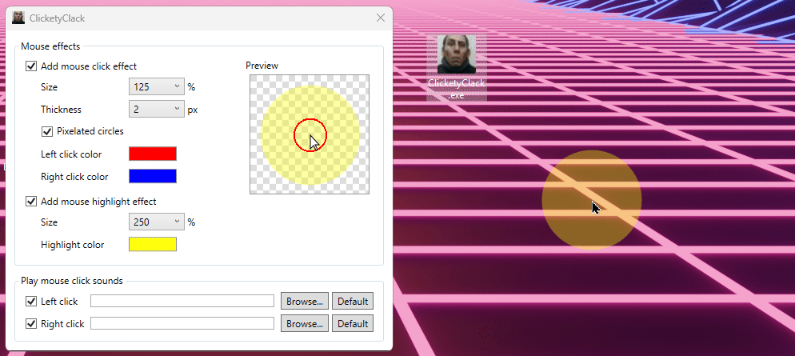

# ClicketyClack

ClicketyClack is a small Windows app that adds click rings and optional sounds to left and right mouse clicks.

This project is intentionally overkill. WPF is far more than this app needs, and that is part of the point. It was made entirely for entertainment purposes.

It is also heavily inspired by Bandicam's mouse effects.



## What it does

- Shows a visual ring when you click
- Lets you set separate colors for left and right click
- Adds an optional cursor highlight
- Plays optional click sounds

## Run locally

```powershell
dotnet run
```

## Prerequisites

- Windows (WPF is Windows-only)
- [.NET 10 SDK](https://dotnet.microsoft.com/download/dotnet/10.0)

## Development

```powershell
git clone <your-repo-url>
cd ClicketyClack
dotnet restore
dotnet run
```

You can work on the project in either:

- VS Code: open the folder and use the C# extension
- Visual Studio: open `ClicketyClack.sln`

## Build a release

```powershell
powershell -ExecutionPolicy Bypass -File .\Publish-Release.ps1
```

That creates a self-contained `win-x64` build and a zip file in `publish\`.

## Project structure

```
Views/      # MainWindow and OverlayWindow (XAML + code-behind)
Models/     # AppSettings
Services/   # MouseHook (global low-level mouse hook)
Assets/     # Icon, sounds, screenshots
```

## Settings

Settings are stored in:

`%AppData%\ClicketyClack\settings.json`
